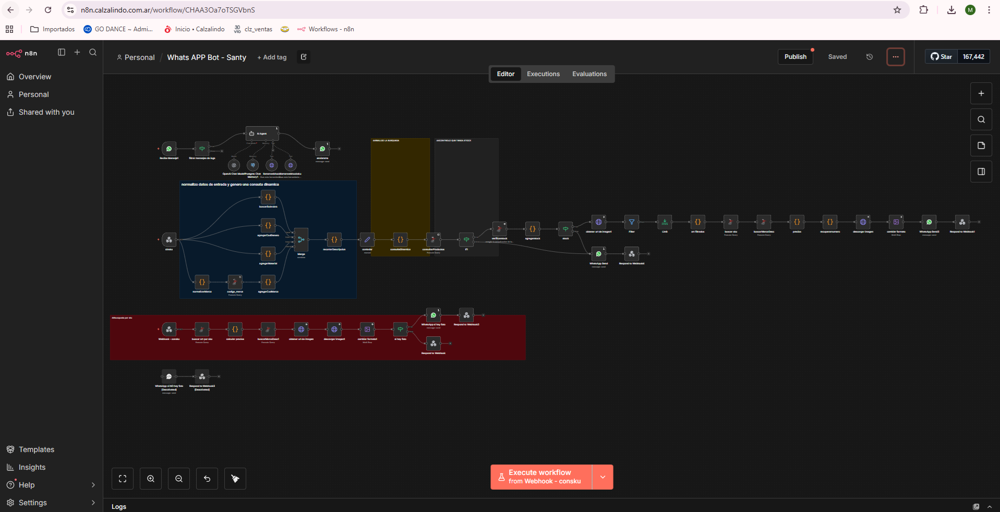

# WhatsApp Bot – CalzaBOT (n8n)

## Descripción general

Este proyecto corresponde a una **automatización en n8n para un chatbot de WhatsApp orientado a la venta y consulta de calzado**.  
Fue **uno de mis primeros workflows**, por lo que **presenta falencias a nivel lógico, estructural y de optimización**, especialmente si se lo evalúa con estándares actuales de diseño de chatbots y agentes conversacionales.

El objetivo principal del flujo es permitir que un usuario consulte productos de calzado mediante WhatsApp utilizando lenguaje natural, aplicar filtros (marca, talle, precio, SKU, etc.) y devolver resultados desde una base de datos empresarial.

---

## Objetivo del workflow

- Recibir mensajes de WhatsApp (texto e imágenes).
- Interpretar la intención del usuario mediante un **AI Agent (LangChain + OpenAI)**.
- Extraer filtros estructurados desde lenguaje natural.
- Consultar productos en una base de datos (Microsoft SQL Server).
- Validar stock, precios e imágenes.
- Responder al usuario con información del producto vía WhatsApp.

---

## Tecnologías utilizadas

- **n8n** (orquestador principal)
- **WhatsApp Business API**
- **OpenAI (GPT-4.1-mini)** vía LangChain
- **Microsoft SQL Server** (artículos, marcas, stock)
- **PostgreSQL** (memoria conversacional)
- **HTTP APIs internas** (imágenes de productos)
- **JavaScript (Code Nodes)** para lógica custom

---

## Arquitectura general del flujo

### 1. Ingreso del mensaje
- Trigger: `WhatsApp Trigger`
- Filtrado de mensajes (texto / audio).
- Identificación del número del cliente como `sessionId`.

### 2. Procesamiento con IA
- **AI Agent (CalzaBOT)**:
  - Extrae:
    - descripción
    - marca
    - SKU
    - talle
    - género
    - subrubro
    - material
    - precio
  - Solicita confirmación antes de ejecutar búsquedas.
  - Decide si llamar al webhook con SKU o sin SKU.

### 3. Persistencia de contexto
- **Postgres Chat Memory**
  - Guarda el historial por número de WhatsApp.
  - Implementación básica, sin control de expiración ni limpieza.

### 4. Normalización de datos
- Conversión de género a códigos internos.
- Acortado de descripciones para compatibilidad con SQL legacy.
- Mapeo de marcas, rubros y subrubros.

### 5. Construcción de SQL dinámico
- Generación manual de consultas SQL con múltiples condiciones:
  - Marca
  - Género
  - Subrubro
  - Material
  - Talle
  - Palabras clave
  - Precio ±15%
- **No se utilizan prepared statements** (riesgo de SQL injection).

### 6. Consulta de productos
- Ejecución de query contra tabla `Articulo`.
- Límite hardcodeado (`TOP 500`).
- Orden por fecha de última compra.

### 7. Validación de stock
- Cruce contra otra fuente de stock.
- Filtrado de productos sin stock.

### 8. Cálculo de precios
- Lógica manual de:
  - Precio regular
  - Débito
  - Contado
  - Cuotas (Ahora 3 y 6)
- Redondeo “psicológico” de precios.

### 9. Imágenes
- Obtención de imagen vía API interna.
- Descarga y conversión de formato.
- Manejo de errores básico (continue on error).

### 10. Respuesta al usuario
- Envío por WhatsApp:
  - Con imagen si existe.
  - Sin imagen si no existe.
- Mensajes de fallback si no hay resultados.

---

## Limitaciones conocidas (importantes)

Este workflow **NO representa una arquitectura óptima de chatbot**. Principales falencias:

- Lógica excesivamente acoplada.
- Mucha lógica de negocio embebida en Code Nodes.
- SQL dinámico inseguro y difícil de mantener.
- Falta de:
  - vectorización / embeddings
  - búsqueda semántica
  - ranking inteligente de resultados
  - control de contexto conversacional real
  - retries y manejo de errores consistente
- Escalabilidad limitada.
- Naming inconsistente de nodos y variables.
- Duplicación de lógica en múltiples ramas.
- Ausencia de tests o validaciones formales.

---

## Qué **NO** es este proyecto

- No es un chatbot enterprise-ready.
- No es una arquitectura recomendada para producción a gran escala.
- No es un ejemplo de buenas prácticas en IA conversacional.

---

## Valor del proyecto

A pesar de sus falencias, este workflow:

- Representa un **primer acercamiento real** a:
  - agentes con IA
  - integración WhatsApp + LLM
  - automatización comercial
- Fue clave como **base de aprendizaje**.
- Permitió identificar claramente qué **NO** hacer en implementaciones futuras.

---

## Posibles mejoras futuras

- Reemplazar SQL dinámico por búsquedas vectoriales.
- Separar lógica de negocio en servicios externos.
- Implementar RAG real con embeddings.
- Normalizar y versionar prompts.
- Manejar estados conversacionales explícitos.
- Optimizar rendimiento y mantenimiento.
- Modularizar el flujo en sub-workflows.

---

## Estado actual

🟡 **Funcional, pero técnicamente inmaduro**  
🟡 Útil como referencia histórica y de aprendizaje  
🔴 No recomendado como base directa para nuevos proyectos

---

**Autor:** Santiago Perez Kay  
**Contexto:** Proyecto experimental / primeros workflows en n8n
